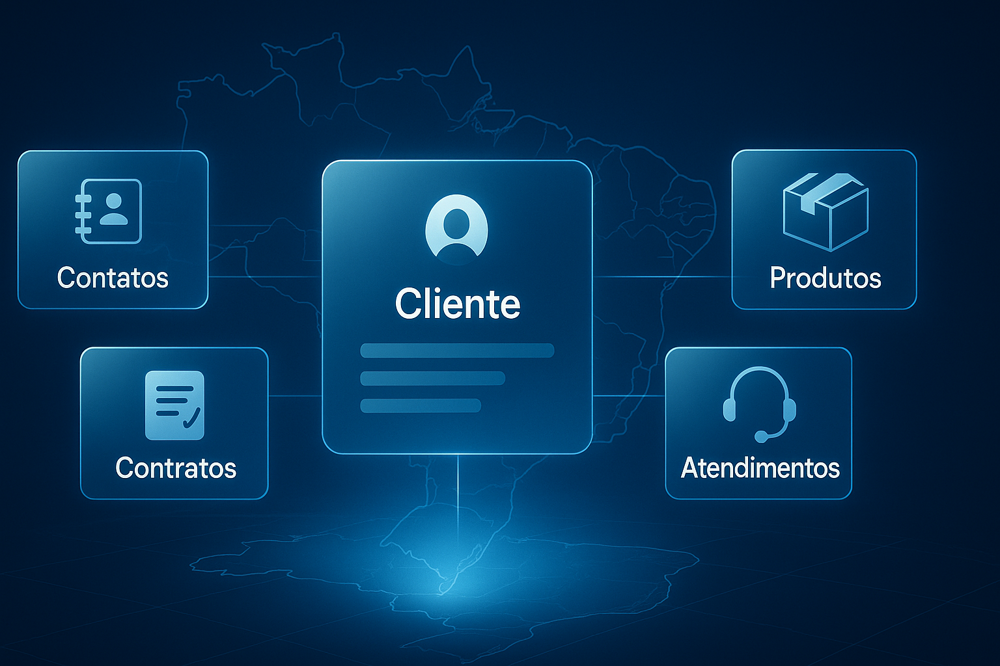

# IMAP SGC — Gestão de Clientes
> O núcleo **de relacionamento** do ERP interno: clientes, contatos, contratos, propostas comerciais e atendimentos.
> **De ColdFusion + Windows Server → Python/FastAPI + Astro/Vite + Docker.**
> **Estado: em andamento — a renovação do ERP interno já começou**, sobre a fundação provada.
> *Uma frente do **[Programa de Modernização IMAP](../PROGRAMA-MODERNIZACAO-IMAP.md)**.*

---

## O que é

O **SGC (Sistema de Gestão de Clientes)** é a metade de relacionamento do ERP interno: cadastro de **clientes e contatos**, **contratos** e **propostas comerciais**, catálogo de **produtos e módulos** e a central de **atendimentos** (tickets) por canal, categoria e responsável. É a memória de quem é cliente, o que contratou e o histórico de suporte.

Nasceu na geração ColdFusion e agora recebe **a mesma base moderna já provada nas outras seis frentes** — é o par comercial do **[SGF](../sgf/resumo-executivo-modernizacao.md)** na renovação do ERP interno, já em andamento.

## O tamanho da renovação (medido no código legado)

Números reais do código-fonte atual — a escala do trabalho:

| Métrica | SGC hoje |
|---|---|
| Páginas `.cfm` | **79** |
| Hub de roteamento único | `appSistemas.cfm` — **~3.170 linhas** num só arquivo |
| Arquivos de script no front | **356** |
| Folhas de estilo | **42** CSS |
| Front-end | template proprietário, sem build nem bundler |
| Plataforma | ColdFusion + Windows Server — **fora de suporte** |

> Reconstruir esse front em **componentes modernos, tipados e reutilizáveis** é o maior salto de UX e de produtividade do ERP interno — e derruba o custo de cada evolução futura.

## De → Para (proposto)

| Dimensão | Antes (legado) | Depois (proposto) |
|---|---|---|
| Plataforma | ColdFusion (EOL) | **Python 3 · FastAPI · open-source** |
| Front-end | template proprietário, sem build | **Astro + Vite + TypeScript** — componentizado e tipado |
| Acesso a dados | camada legada | **SQLAlchemy (ORM) — consultas parametrizadas por construção** |
| Sistema operacional | Windows Server (EOL) | **Linux + Docker** |
| Banco | SQL Server (lado a lado na migração) | **PostgreSQL** (destino), lendo o mesmo banco durante o cutover |
| Licenciamento | CF + Windows + template pago | **R$ 0 (open-source)** |
| Testes automatizados | — | **pytest** (API) + rotas de tela verificadas |
| Entrega | manual | **CI + deploy conteinerizado** |
| TLS/HTTPS | manual | **Let's Encrypt automático** |

## 🏆 Ganhos desta frente

- **🚀 Modernização — 356 arquivos viram componentes.** O front do template proprietário dá lugar a **componentes Astro/Vite tipados e reutilizáveis**, com build instantâneo.
- **💸 Custos — fim do template pago.** Licença de plataforma + template proprietário saem; stack **R$ 0** no host consolidado.
- **🧱 Endurecimento — entrada validada por padrão.** **FastAPI + Pydantic validam toda entrada**, consultas **parametrizadas por construção**, dependências **modernas e mantidas**.
- **🛡️ Salvaguarda — dados de clientes protegidos.** **WAF + SIEM + TLS + JWT** e renderização que **escapa dados por padrão** — a memória comercial do Instituto sob as camadas atuais de segurança.
- **🧭 Futuro — o domínio que faltava.** **Modelo único** de clientes, contratos, propostas e atendimentos (ORM explícito); par do **SGF** — juntos **fecham a renovação do ERP interno**.

> ♻️ Somam-se os **benefícios comuns do programa** — **licença R$ 0**, base mantida e com patches, **Linux + Docker + OCI**, **segurança em profundidade** (WAF · SIEM · SELinux · TLS automático), **migração incremental e reversível**, mão de obra abundante, **sem parar a operação** — descritos uma única vez no **[Programa, §3](../PROGRAMA-MODERNIZACAO-IMAP.md)**.

## 📍 Estado & próximos passos

Esta frente — par do **[SGF](../sgf/resumo-executivo-modernizacao.md)** na renovação do ERP interno anunciado no **[Pitch](../PITCH.md)** (§6) — **já está em andamento**: o serviço novo **já entrou no host Docker consolidado**, herdando toda a fundação (CI, autenticação, WAF/SIEM/SELinux). O diagnóstico do legado está completo (números acima) e a renovação segue o **método provado**: módulo a módulo, lendo o mesmo banco, com rollback.

## 🧰 Tecnologias

Python · FastAPI · SQLAlchemy · Astro · Vite · TypeScript · Docker · Linux/OCI · PostgreSQL · pytest · Let's Encrypt · CI — impacto de cada uma em **[TECNOLOGIAS.md](../TECNOLOGIAS.md)**.

## 🗺️ Roadmap

1. **Mapear o domínio** (clientes, contatos, contratos, propostas, atendimentos) e cobrir com testes de caracterização.
2. **Subir a API FastAPI lendo o mesmo banco**, módulo a módulo, ao lado do legado.
3. **Reconstruir o front em Astro/Vite**, aposentando o SmartAdmin e os ~100 plugins tela a tela.
4. **Cutover gradual + rollback**; integrar com o SGF para fechar o ERP interno.
